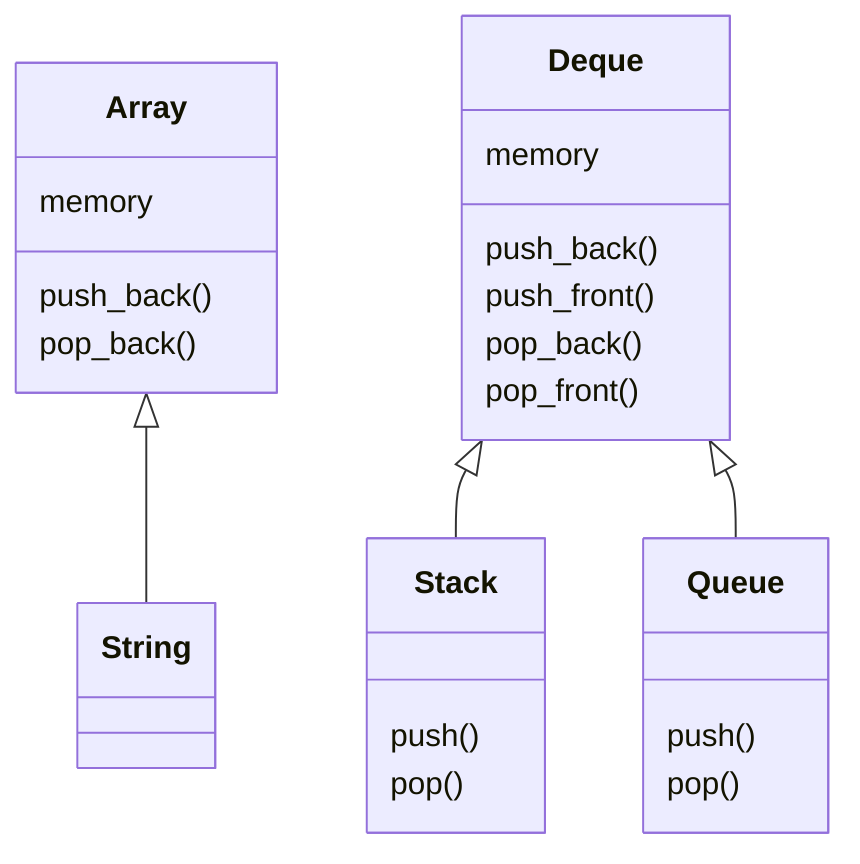
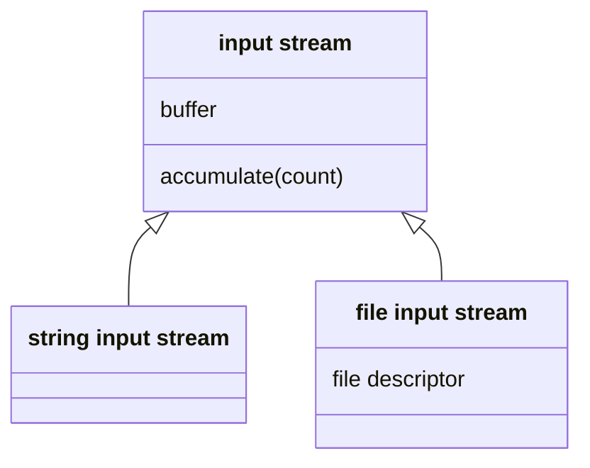

# Lib O2S

Reliant datastructure library for C.

The [include](include) folder contains the public interface, while the [src](src) folder contains the implementation.

## Data structures



### Primary
- [Array](https://orolia2s.pages.orolia.com/libo2s/array_8h.html): Dynamic array
- [Deque](https://orolia2s.pages.orolia.com/libo2s/deque_8h.html): Double-ended queue

### Secondary
- [String](https://orolia2s.pages.orolia.com/libo2s/string_8h.html): Dynamic character array
- [Queue](https://orolia2s.pages.orolia.com/libo2s/queue_8h.html): FIFO
- [Stack](https://orolia2s.pages.orolia.com/libo2s/stack_8h.html): LIFO

## Input/Output


- [File Input Stream](https://orolia2s.pages.orolia.com/libo2s/file__input__stream_8h.html): Buffered file reader
- [String Input Stream](https://orolia2s.pages.orolia.com/libo2s/string__input__stream_8h.html): Interchangable with a file input stream, to mock / test
- [Serial Ports](https://orolia2s.pages.orolia.com/libo2s/serial_8h.html): Configure and read from serial ports

## Utilities
- [Logging functions](https://orolia2s.pages.orolia.com/libo2s/log_8h.html)
- [String conversions](https://orolia2s.pages.orolia.com/libo2s/to__string_8h.html)
- [Useful Macros](https://orolia2s.pages.orolia.com/libo2s/preprocessing_8h.html)
- [Timers](https://orolia2s.pages.orolia.com/libo2s/timer_8h.html)
- [Mutex](https://orolia2s.pages.orolia.com/libo2s/mutex_8h.html)

# Usage

## Build

```shell
zig build
```

## Test

```shell
zig build test
```

## Generate documentation

```shell
zig build doc
```
