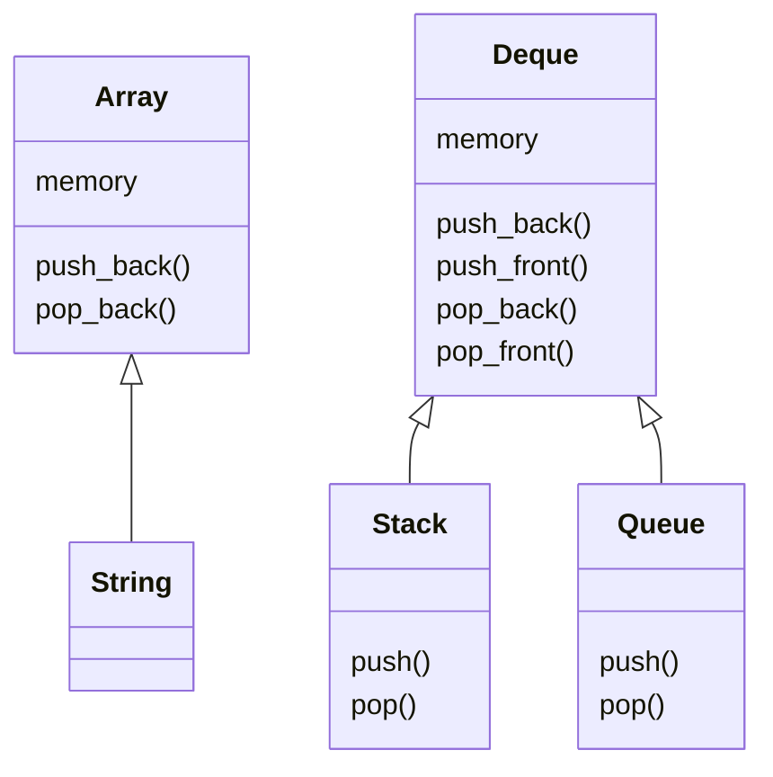
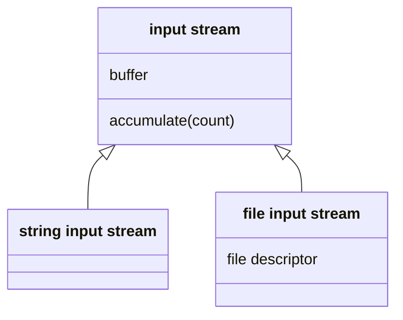

# Lib O2S

Reliable datastructure library for C.

The [include](include) folder contains the public interface, while the [src](src) folder contains the implementation.

## Data structures



### Primary
- [Array](include/o2s/array.h): Dynamic array
- [Deque](include/o2s/deque.h): Double-ended queue

### Secondary
- [String](include/o2s/string.h): Dynamic character array
- [Queue](include/o2s/queue.h): FIFO
- [Stack](include/o2s/stack.h): LIFO

## Input/Output


- [File Input Stream](include/o2s/file_input_stream.h): Buffered file reader
- [String Input Stream](include/o2s/string_input_stream.h): Interchangable with a file input stream, to mock / test
- [Serial Ports](include/o2s/serial.h): Configure and read from serial ports

## Utilities
- [Logging functions](include/o2s/log.h)
- [String conversions](include/o2s/to_string.h)
- [Useful Macros](include/o2s/preprocessing.h)
- [Timers](include/o2s/timer.h)
- [Mutex](include/o2s/mutex.h)

# Usage

## Use in your project

Add the dependency in your `build.zig.zon` by running the following command:
```shell
zig fetch --save git+https://github.com/Orolia2s/libo2s#master
```

Then, in your `build.zig`:
```zig
const libo2s = b.dependency("libo2s", .{ .target = target, .optimize = optimize }).artifact("o2s");

// wherever needed:
exe.linkLibrary(libo2s);
```

## Build

requires [zig](https://ziglang.org/download/) >= 0.14.0

```shell
zig build
```

## Test

```shell
zig build test
```

## Generate documentation

requires [doxygen](https://www.doxygen.nl/download.html)

```shell
zig build doc
open doc/html/index.html
```
